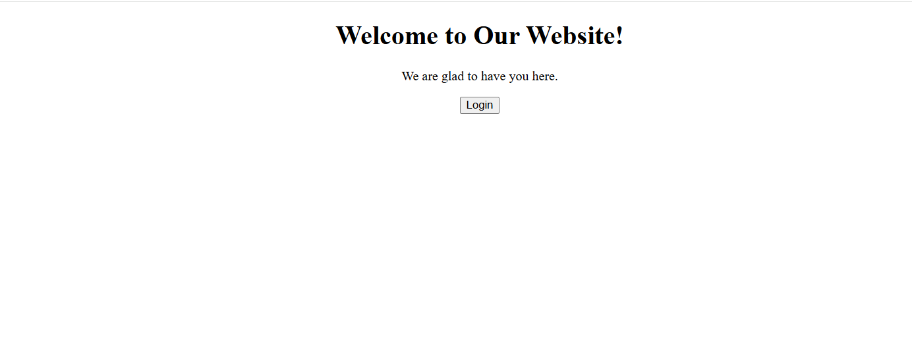
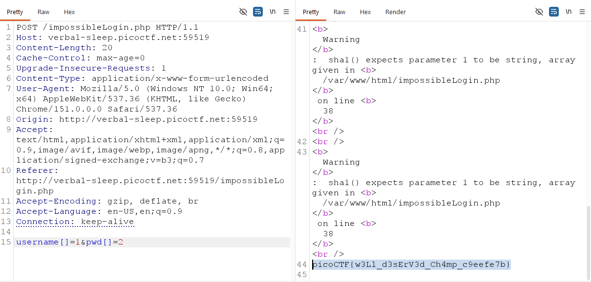

# Apriti Sesamo

Category: Web Exploitation

Difficulty: Medium

Author: Junias Bonou

---

## Challenge Description

> I found a web app that claims to be impossible to hack!

---

## Reconaissance



The application include routes:


| Route        | Function          |
| ------------ | ----------------- |
| /<br />      | Landing page      |
| /login<br /> | Authenticate User |
| <br />       |                   |

---

## Exploitation

Từ gợi ý đề bài cho thấy, server dùng trình biên tập mã lệnh Emacs để lưu lại tệp sao lưu tạm thời.

Tiến hành kiểm tra: `view-source:http://verbal-sleep.picoctf.net:53689/impossibleLogin.php~`

thu được đoạn ghi chú backup:

```
if (isset($_POST['username']) && isset($_POST['pwd'])) {
    $yuf85e0677 = $_POST['username'];
    $rs35c246d5 = $_POST['pwd'];

    // Điều kiện 1: Nếu username giống hệt pwd
    if ($yuf85e0677 == $rs35c246d5) {
        echo "<f/>Failed! No flag for you";
    } else {
        // Điều kiện 2: Kiểm tra SHA1 collision hoặc Mảng (Array Bypass)
        if (sha1($yuf85e0677) === sha1($rs35c246d5)) {
            echo file_get_contents("../flag.txt");
        } else {
            echo "<f/>Failed! No flag for you";
        }
    }
}
```

Để lấy được nội dung file `../flag.txt`, bạn cần thỏa mãn 2 điều kiện:

1. `$yuf85e0677` khác `$rs35c246d5` (để vượt qua bước `if ($yuf85e0677 == $rs35c246d5)`).
2. `sha1($yuf85e0677) === sha1($rs35c246d5)` phải trả về `true`

Trong PHP, hàm `sha1()` sẽ trả về NULL nếu tham số truyền vào là một mảng. Vì `NULL == NULL` luôn đúng nên chỉ cần gửi dữ liệu bảng qua POST sẽ thỏa mãn 2 điều kiện trên:



flag: `picoCTF{w3Ll_d3sErV3d_Ch4mp_c9eefe7b}`
