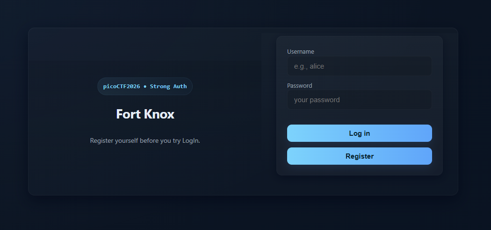
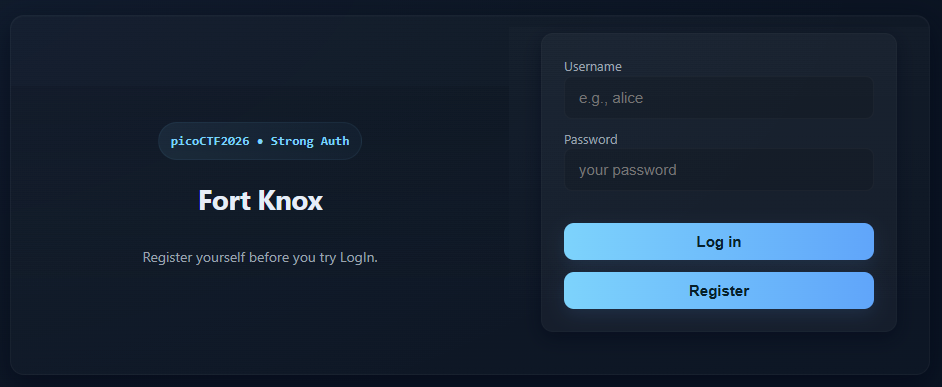
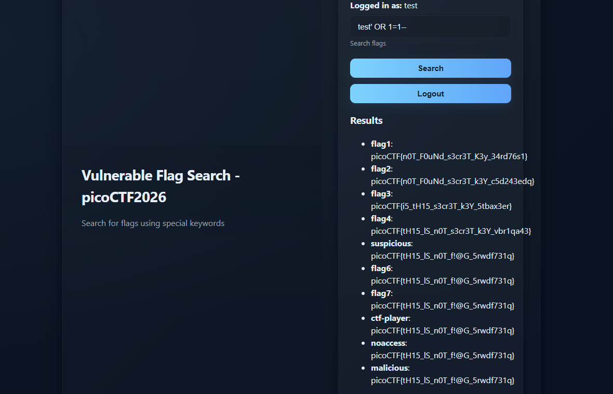
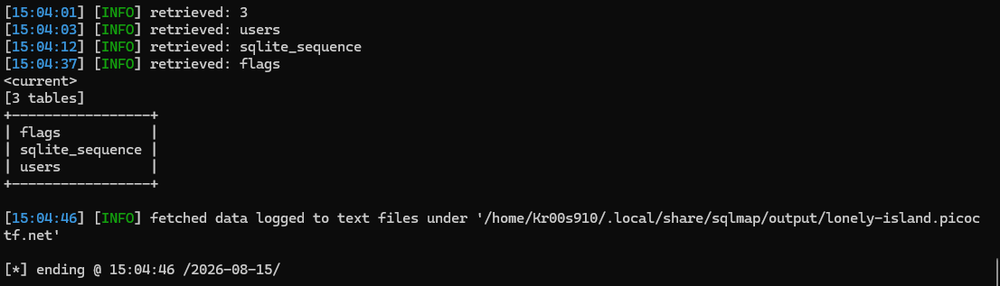
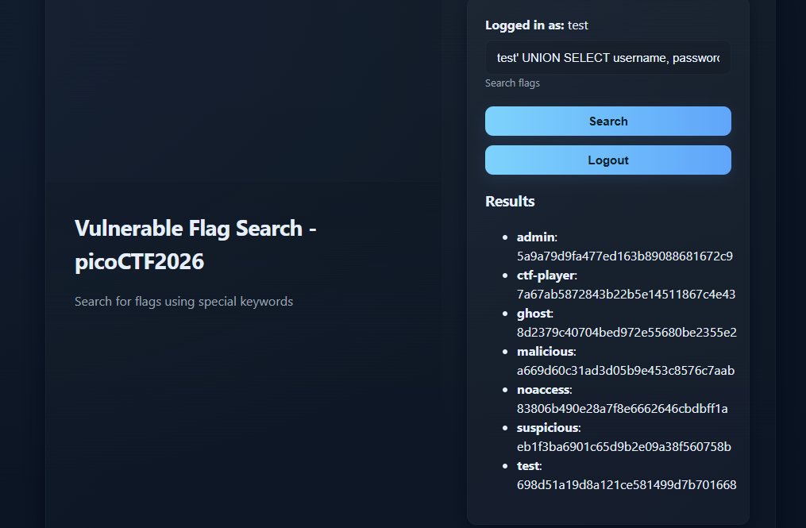

# Sql Map1

**Category**: Web Exploitation

**Difficulty**: Medium

**Author**: Aditya Sudhansu

---

## Challenge Description

> You’ve been hired by a shadowy group of pentesters who love a good puzzle. The system looks ordinary, but appearances lie. Somewhere inside, sloppy code and legacy hashing practices left a tiny, perfect doorway for an attacker.
>
> Your mission — should you choose to accept it — is to slip through that doorway, act as a legit user and retrieve the secret flag.

---

## Reconaissance

The application exposes main routes:

| Route                                                                                                              | Function             |
| ------------------------------------------------------------------------------------------------------------------ | -------------------- |
| /                                                                                         | Landing page         |
| /login                   | Authenticate users   |
| /Register                                                                                                          | Create a new account |

---

## Vulnerable Analysis

### Login - Not Vulnerable

The first instinct is to test the login form for SQL Injection

Testing standard payloads such as `' OR 1=1` against the login form produces no results. The login query uses prepared statement which correctly bind user input as data rather than interpolating it into the query string. The login endpoint is not injectable.

### Search Flag: Vulnerable

Try injecting a single quote: `test' OR 1=1--` into this field exposes the raw backend query:

The application exist SQL Injection. Conducting SQLMap to check revealing infomation.

After scan by SQLMap, retrieve 3 table include: flags, users, sqlite_sequence.

Check users table by query: `' UNION SELECT username, password FROM users--`

From hints , password is hashed by MD5. Using Tool Onlines to crack password ctf-player (act as a legit user so not admin): `password: dyesebel`

Logout test account and login ctf-player account --> Retrive flag: `picoCTF{F0uNd_s3cr3T_K3y_f0R_w3_<>}`
